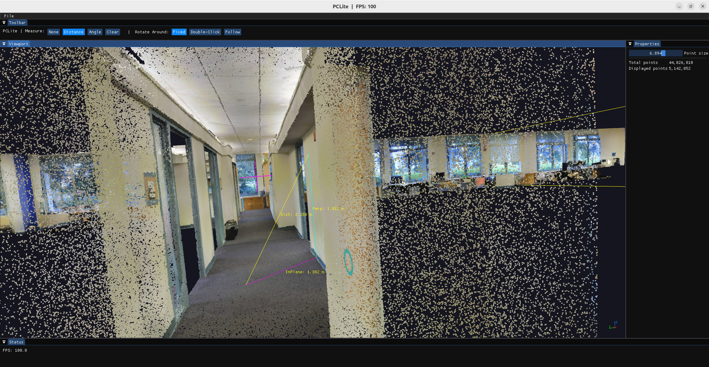

# PCLite

PCLite is a lightweight desktop application for viewing and measuring large-scale point clouds, built with C++20, OpenGL, SDL2 and Dear ImGui.



## Why

Common point cloud formats (LAS, PCD, ...) load as a single flat blob, so once a point cloud gets large enough it simply doesn't fit in memory and can't be visualized or processed. PCLite is built around solving that problem end to end:

- **Out-of-core point cloud format** — a chunked, level-of-detail octree format (conceptually similar to Potree), produced by a multi-stage converter
- **Real-time visualization** — OpenGL rendering that streams nodes in/out based on screen-space error (LOD), instead of holding the whole point cloud in memory
- **Interactive measurement** — distance and angle measurement directly on the point cloud, built on GPU-based point picking with a live, KD-tree-assisted local plane fit: distance decomposes into point-to-point / perpendicular-to-plane / in-plane components, angle shows a live arc + readout. While measuring, a real-time ring decal tracks the cursor and shows the locally-fitted reference plane, refining from the current LOD up to full resolution in the background as you move the mouse
- **Project-based workflow** — create/open/manage point cloud projects, import raw LAS files with live progress, no manual file wrangling

## Performance

Performance is the main thing PCLite is built around — converting fast, staying within bounded memory regardless of dataset size, and keeping the viewer interactive (not just "able to open the file").

- **Conversion speed.** The converter is parallelized at every stage (chunking, hierarchy build, sampling, merging) using independent per-thread LAS readers (`AttributeReader::clone()`) and a "count → allocate → fill" bucketing strategy instead of locking shared containers. On a 49M-point / 1.2GB LAS file (`test_data/office.las`, Release build), end-to-end conversion takes **~6.5s**, a 9.7x improvement over the unoptimized baseline (63.3s) and on par with reference tool PotreeConverter (6.0s) for the equivalent work — PCLite is actually ~5% *faster* once you account for the extra KD-tree index it builds per node that PotreeConverter doesn't.
- **Bounded memory, not "load everything."** Both the converter and the viewer are out-of-core by design: the converter flushes each chunk's promotable points to disk as soon as they're sampled and only re-reads bounded batches during the final merge (batched by a point-count threshold, not by total dataset size); the viewer's LRU strategy caps the number of resident octree nodes regardless of how large the underlying point cloud is. Dataset size is bounded by disk, not RAM.
- **Frame rate.** The viewer never renders the whole point cloud — `NodeManager` streams nodes in/out based on projected screen-space error, so the rendered point budget (and therefore frame time) stays roughly constant whether the dataset is 1M or 1B points. A live FPS counter in the title bar makes this directly observable while navigating.
- **Point-picking assist.** Picking is GPU-driven and on-demand (no per-frame ID buffer baking): clicking or hovering a point triggers a small FBO read-back that resolves the exact (node, point) under the cursor, then fits a local plane through its neighborhood using a per-node KD-tree (built once at conversion time) — first synchronously from whatever LOD is currently resident, then progressively refined in the background down to full resolution. The result is an immediate visual response (a ring on the fitted plane) that gets sharper without blocking the UI, even while sweeping the mouse across the cloud. This plane fit only runs while a Measure mode is active, so ordinary navigation never pays for it.

## Architecture

```
Raw point cloud (LAS/...)
      │  converter: chunk → build hierarchy skeleton → per-chunk sampling → cross-chunk merge
      ▼
PCLite dataset (metadata.json + hierarchy.bin + octree.bin + kdtree.bin + ...)
      │  viewer: on-demand loading → dynamic LOD (load/evict) → OpenGL rendering
      ▼
Interactive visualization + point picking / measurement
```

| Module | Path | Responsibility | Status |
|---|---|---|---|
| core | `src/core` | Basic types: vec3/mat, BoundingBox, Attributes, KD-tree, plane fit | Implemented |
| converter | `src/converter` | Converts raw point cloud formats into the PCLite chunked octree format | Implemented |
| viewer | `src/viewer` | Window/camera/layers/node streaming/rendering/picking | Implemented |
| project | `src/project` | Project create/open/close/delete, recent list, LAS import | Implemented |
| ui | Dear ImGui (vendored) | Docking chrome (Hub / Project mode), panels, file browser | Implemented |
| measurement | `src/viewer/measurement` | Distance & angle measurement (plane-fit decomposition, angle arc) on top of picking | Implemented |

## Repository layout

```
PCLite/
├── CMakeLists.txt / CMakePresets.json   Top-level build configuration
├── vcpkg.json                            vcpkg manifest (SDL2)
├── main.cpp / application.{h,cpp}        Application entry point & orchestrator
├── 3rd_party/                             Vendored/FetchContent dependencies (ImGui, glad, ThreadPool, ...)
├── cmake/                                 CMake helper modules
└── src/                                   core / converter / viewer (incl. measurement) / project / utilities
```

## Building

### Requirements

- CMake ≥ 3.20 and a C++20 compiler (MSVC / GCC / Clang)
- [vcpkg](https://github.com/microsoft/vcpkg) (set `VCPKG_ROOT`), used to install SDL2
- OpenGL

Everything else (nlohmann/json, spdlog, Dear ImGui, glad, googletest, ThreadPool) is fetched automatically via CMake `FetchContent` — no manual install needed.

### Using CMake Presets

```bash
# Linux
cmake --preset linux-Debug
cmake --build --preset linux-Debug

# Windows
cmake --preset x64-Debug
cmake --build --preset x64-Debug
```

## Running

```bash
./PCLite
```

The app opens to a project hub: create a new project from a LAS file (converted in the background with progress feedback), or open one from the recent/all-projects list. Inside a project, the viewer supports arcball navigation (left-drag to rotate, right-drag to pan, scroll to zoom) and point picking (click or hover a point to highlight it and preview the locally-fitted plane).

The toolbar (see screenshot above) switches two independent modes:
- **Measure**: `None` / `Distance` (click 2 points — decomposes into point-to-point, perpendicular-to-plane, and in-plane distances) / `Angle` (click 3 points — vertex is the 2nd click) / `Clear`.
- **Rotate Around**: `Fixed` (orbit the original look-at target), `Double-Click` (double-click a point to re-pivot orbiting there), `Follow` (every press re-pivots to whatever's under the cursor, at the same distance as the current pivot — works over empty space too).

## Testing

Tests use GoogleTest + CTest, split per module (`core`, `converter`, `project`, `viewer`).

```bash
cmake --build <build_dir> -j$(nproc)
cd <build_dir> && ctest --output-on-failure
```

## Status

- ✅ Project management, converter, and viewer (LOD streaming, rendering, GPU point picking with plane-fit assist) are implemented and tested
- ✅ Measurement: distance (point-to-point / perpendicular-to-plane / in-plane decomposition) and angle (live arc + readout) are implemented, with screen-space value labels and a toolbar mode switch
